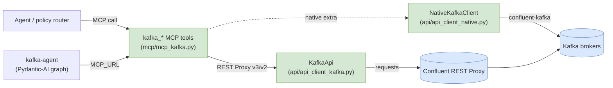
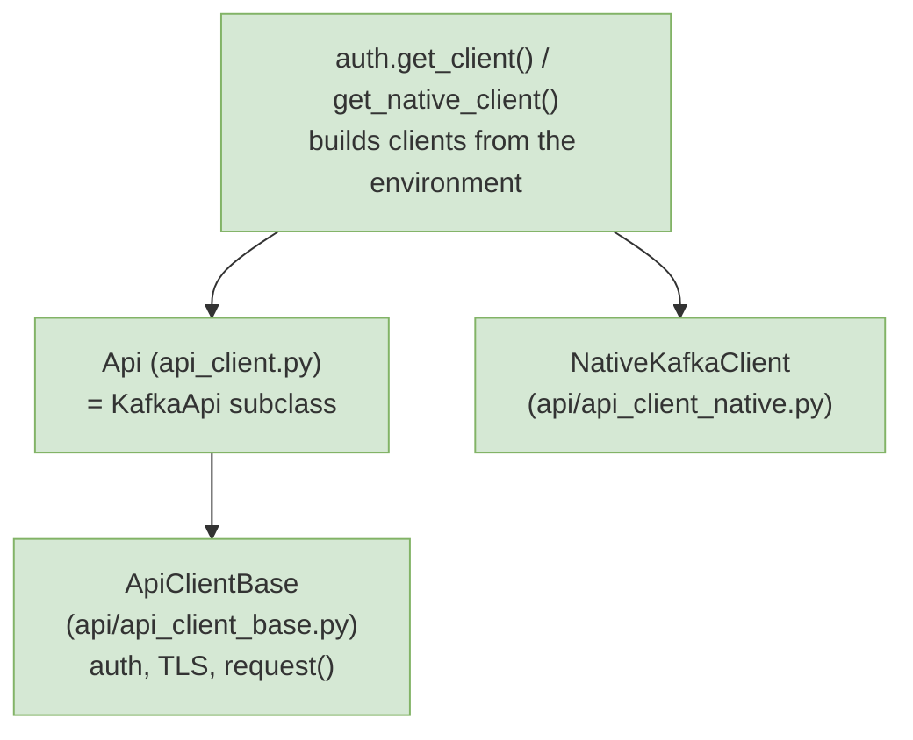

# Architecture

How `kafka-mcp` fits together: a layered REST client, thin MCP tool wrappers, an
optional native broker client, and an optional Pydantic-AI agent server.

## The request path

The MCP tools add no business logic — they parse the `action` / `params_json` payload
and dispatch to a `KafkaApi` (or `NativeKafkaClient`) method. All API surface lives in
`kafka_mcp.api`.

## Layered client

- **`ApiClientBase`** centralizes bearer-token / basic-auth, TLS verification, and a
  single `request()` helper.
- **`KafkaApi`** organizes the REST surface by resource (clusters, topics,
  partitions, records, consumer groups, brokers, ACLs) and resolves the cluster id
  lazily.
- **`Api`** is the public facade re-exported for import.
- **`NativeKafkaClient`** is the optional `confluent-kafka` path for direct broker
  produce / consume / admin.

## Entry points

- `kafka_mcp.mcp_server:mcp_server` — the FastMCP server (`kafka-mcp` console
  script), with a `/health` endpoint on HTTP transports.
- `kafka_mcp.agent_server:agent_server` — the Pydantic-AI agent server
  (`kafka-agent` console script), wired to the MCP server through `MCP_URL`.
